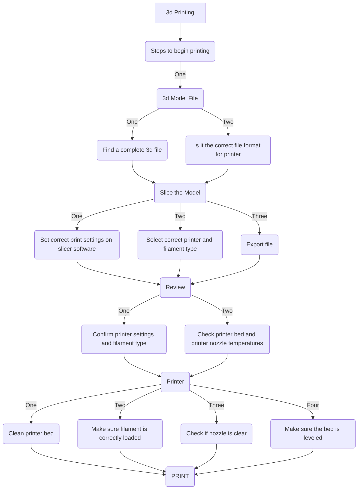

#Steps to 3d printing
  -3d Model File
    -Need to find a 3d file that will work with printer
  -Slice the Model
    -Slicing model to correct format so the printer can read it
  -Review
    -Make sure the settings are correct so the printer is able to print it without any problems
  -Printer
    -Make sure the printer physically is ready to print
  -Print
    -Print and wait for results or stop it if any issues occur
